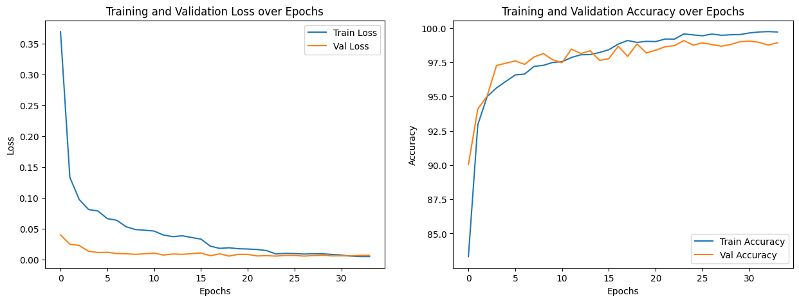

# 🐾 Animal Face Classification

> A deep learning project for classifying animal faces using PyTorch and Convolutional Neural Networks

[](https://www.python.org/downloads/)
[](https://pytorch.org/)
[](LICENSE)

## 📋 Overview

This project implements a custom CNN architecture trained on the **AFHQ (Animal Faces HQ)** dataset to distinguish between cats, dogs, and wild animals. The model leverages modern deep learning techniques including data augmentation, batch normalization, and adaptive learning rate scheduling to achieve robust classification performance.

---

## ✨ Features

| Feature | Description |
|---------|-------------|
| **Custom CNN** | 3-layer convolutional architecture with batch normalization |
| **Data Augmentation** | Random flips, rotations, and color jittering for better generalization |
| **Smart Scheduling** | ReduceLROnPlateau for adaptive learning rate |
| **Comprehensive Split** | 70% train / 15% validation / 15% test |
| **Live Monitoring** | Real-time training metrics and visualization |
| **Easy Inference** | Simple API for predicting new images |

---

## 🚀 Quick Start

### Installation

```bash
pip install torch torchvision scikit-learn matplotlib pandas numpy Pillow torchsummary
```

### Download Dataset

```python
!pip install opendatasets --quiet
import opendatasets as od
od.download('https://www.kaggle.com/datasets/andrewmvd/animal-faces')
```

> **Note:** You'll need [Kaggle API credentials](https://www.kaggle.com/docs/api) to download the dataset

### Dataset Structure

```
animal-faces/afhq/
├── 📁 train/
│   ├── 🐱 cat/
│   ├── 🐶 dog/
│   └── 🦁 wild/
└── 📁 val/
    ├── 🐱 cat/
    ├── 🐶 dog/
    └── 🦁 wild/
```

---

## 🏗️ Model Architecture

---

## 🎨 Data Augmentation

Training images undergo various transformations:

| Augmentation | Configuration |
|--------------|---------------|
| **Horizontal Flip** | 50% probability |
| **Random Rotation** | ±15 degrees |
| **Color Jitter** | Brightness, contrast, saturation (0.2) |
| **Normalization** | ImageNet statistics |

---

## ⚙️ Training Configuration

```python
LEARNING_RATE = 1e-3
BATCH_SIZE = 16
EPOCHS = 30
OPTIMIZER = Adam
LOSS_FUNCTION = CrossEntropyLoss
LR_SCHEDULER = ReduceLROnPlateau(factor=0.5, patience=3)
```

**GPU Support:** Automatically detects CUDA and falls back to CPU if unavailable

---

## 📊 Training Visualizations

The script generates comprehensive plots to monitor model performance:

### Loss Curves
<table>
<tr>
<td width="50%">

**Training Loss**
- Measures fit on training data
- Should decrease steadily

</td>
<td width="50%">

**Validation Loss**
- Indicates generalization
- Helps detect overfitting

</td>
</tr>
</table>

### Accuracy Curves
<table>
<tr>
<td width="50%">

**Training Accuracy**
- % of correct predictions on training set
- Typically reaches 90%+

</td>
<td width="50%">

**Validation Accuracy**
- % of correct predictions on validation set
- Best indicator of real-world performance

</td>
</tr>
</table>

**Sample Training Output:**
```
Epoch 1  → Train loss: 0.0234, Val loss: 0.0198 | Train Acc: 65.32%, Val Acc: 68.45%
Epoch 2  → Train loss: 0.0187, Val loss: 0.0165 | Train Acc: 72.18%, Val Acc: 74.92%
...
Epoch 30 → Train loss: 0.0045, Val loss: 0.0052 | Train Acc: 94.67%, Val Acc: 92.33%
```

The final visualization helps you identify:
- ✅ **Convergence behavior** - Are both metrics stabilizing?
- ⚠️ **Overfitting** - Is train accuracy >> validation accuracy?
- 📈 **Learning effectiveness** - Are metrics improving over time?


---

## 💻 Usage

### Training the Model

```python
python main.py
```

The script handles everything: data loading, augmentation, training, validation, and saving the model.

### Making Predictions

```python
from train import predict_image

# Classify a new image
result = predict_image("/path/to/your/image.jpg")
print(f"Predicted: {result}")  # Output: 'cat', 'dog', or 'wild'
```

### Loading Saved Model

```python
import torch
from train import Net

model = Net()
model.load_state_dict(torch.load("my_model.pth"))
model.eval()
```

---

## 📦 Output Files

| File | Description |
|------|-------------|
| `my_model.pth` | Trained model weights |
| Training plots | Loss and accuracy visualizations |
| Console logs | Epoch-wise performance metrics |

---

## 📈 Performance Metrics

The model tracks and reports:
- ✓ Training/validation loss per epoch
- ✓ Training/validation accuracy per epoch
- ✓ Final test set accuracy and loss
- ✓ Learning rate adjustments

---

## 🗂️ Project Structure

```
📦 animal-face-classification/
├── 📄 train.py              # Main training script
├── 💾 my_model.pth          # Saved model weights
└── 📖 README.md             # Documentation
```

---

## 🔍 Technical Details

- **Image Size:** 128×128 pixels
- **Normalization:** ImageNet statistics (mean=[0.485, 0.456, 0.406], std=[0.229, 0.224, 0.225])
- **Dropout Rate:** 0.5 before final layers
- **LR Reduction:** 50% when validation loss plateaus for 3 epochs
- **Device:** Auto-detection (CUDA → CPU)

---

## 🎯 Future Improvements

- [ ] Transfer learning with ResNet/EfficientNet
- [ ] Confusion matrix visualization
- [ ] Support for additional animal classes
- [ ] Gradio web interface for inference
- [ ] Model quantization for mobile deployment
- [ ] TensorBoard integration
- [ ] Cross-validation implementation

---

## 📚 Dataset Source

**AFHQ (Animal Faces HQ)** dataset by Andrew M. on Kaggle  
🔗 [https://www.kaggle.com/datasets/andrewmvd/animal-faces](https://www.kaggle.com/datasets/andrewmvd/animal-faces)

---

## 📄 License

This project is open source and available under the **MIT License**.

---

## 🤝 Contributing

Contributions, issues, and feature requests are welcome! Feel free to check the issues page.

---

<div align="center">

**Built with PyTorch** 🔥

*Happy Classifying!*

</div>
